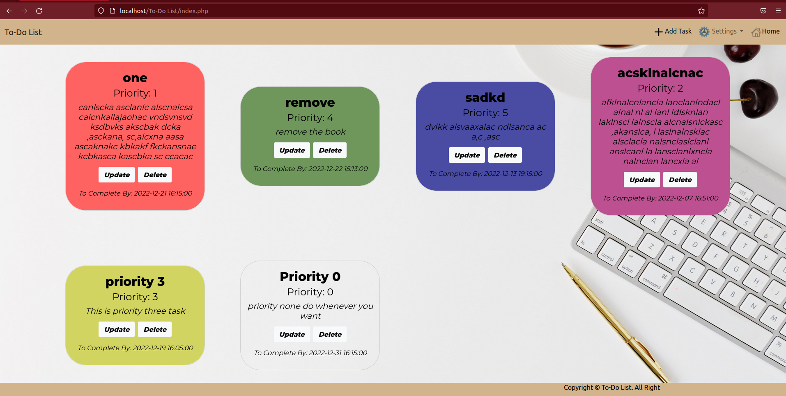
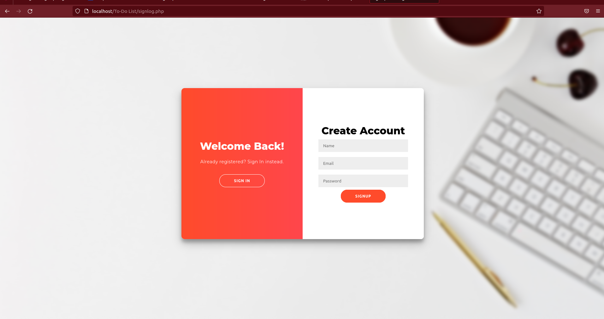
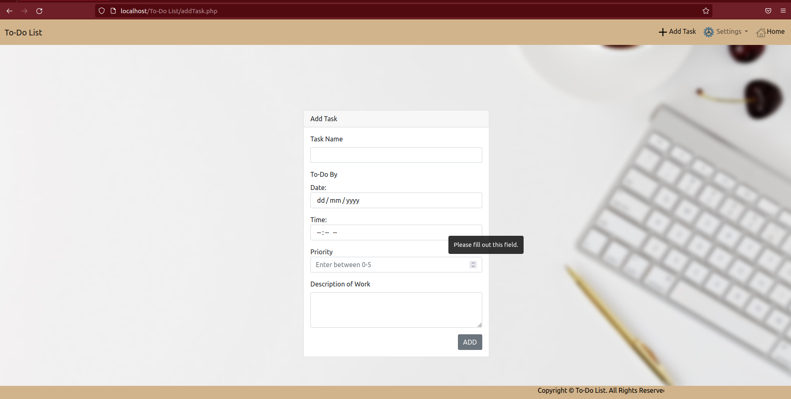
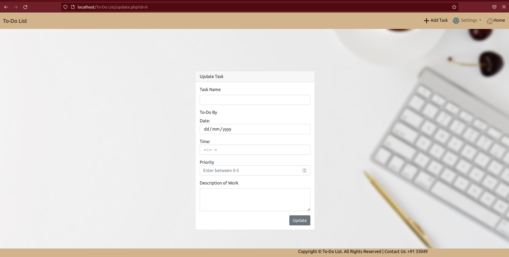

To-Do List
==========
This is a simple To-Do List website project where users can create their account, users can login and when their session is active they can add task to their list, remove from the list and can update too.

# Technology Used

- **Front-End:** HTML, CSS and JavaScript.
- **Back-End:**  PHP and MySQL.
- **CSS Framework:** Bootstrap.

# Web Pages of the Website

## Home

When users are in the home page they can see all their tasks that have been added by them. Users can stay in the home page as long as they are logged in. If users are not logged in they are redirected to signlog page. Home page is responsive i.e., view of the page adapts with the screen size of a device. Also all tasks are displayed as grid view which is responsive too.  Each tasks are displayed as grid items and each grid items has update and delete options. the color of the grid items changes according to the priority of the task. Also task name, description and date and time to complete the task is also displayed in the grid item.

## Signlog

In this page user can sign in or sign up. In this page there exist a toggle form which toggles with the clicks of the user. If user wants to sign in user can toggle to sign in side and if user wants to signup user can toggle to sign up side. This page cannot be visited if the user is already logged in.

## AddTask

In this page user can Add Task. While adding user have to provide details in the form. The First details is to give a Task name after that user have to give date and time as a last day to complete it. After date and time, user needs to provide the priority of the task. And then the description of the task.

## Update Task

In this page user can update Task. While updating user have to provide details in the form. The First details is to give a Task name after that user have to give date and time as a last day to complete it. After date and time, user needs to provide the priority of the task. And then the description of the task.

# Summary

There is a lot of things that can be added  in this project. 

# Author

- Joshua Biswakarma